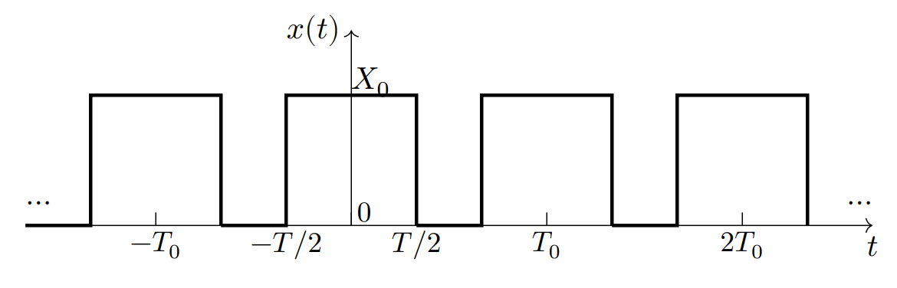

# Fourier series (푸리에 계수)  

**Divide and Conquer**을 직역하면 쪼개서 정복하다라는 뜻인데 공학에서 이는 복잡한 문제를 잘게 쪼개서 해를 구하는 과정을 의미한다. Fourier Series 또한 이에 속한다.  
**Fourier Series**를 간단하게 말하면 복잡한 주기함수를 단순한 신호들의 합으로 표현하는 것이다.

## Fourier Series의 다양한 형태  
Fourier Series는 다양한 형태로 복잡한 주기 함수를 표현한다.  
*아래 식에서 계속 등장하는 $\int_{T_0}$는 적분 구간의 길이가 $T_0$임을 의미한다.*

### complex exponential form  
$$x(t) = \displaystyle\sum^{\infty}_{k=-\infty}C_ke^{jk\omega_0t}, C_k = C_{-k}^*$$  
$$C_k = \frac{1}{T_0}\int_{T_0}x(t)e^{-jk\omega_0t}dt$$

### combined trigonometric form  
$$x(t) = C_0 + \displaystyle\sum^{\infty}_{k=1}2|C_k|cos(k\omega_0t + \theta_k)$$  
$$C_k = \frac{1}{T_0}\int_{T_0}x(t)e^{-jk\omega_0t}dt$$

### trigonometric form  
$$x(t) = a_0 + \displaystyle\sum_{k=1}^{\infty}(a_kcos(k\omega_0t)+b_ksin(k\omega_0t))$$  
$$a_k = \frac{2}{T_0} \int_{T_0}x(t)cos(k\omega_0t)dt,\quad b_k = \frac{2}{T_0} \int_{T_0}x(t)sin(k\omega_0t)dt,\quad a_0 = \frac{1}{T_0}\int_{T_0}x(t)dt$$

### Fourier Coefficient ($C_k$)

* $C_0$는 신호 $x(t)$의 DC 값 또는 평균 값이다. $\because C_0 = \displaystyle\frac{1}{T_0}\int_{0}^{T_0}x(t)dt$  
* $f(t)$와 $g(t)$가 구간 a, b에서 orthoginal(직교)하면 $\displaystyle\int_{a}^{b}f(t)g(t)= 0$이다.  
* The harmonics in the Fourier series(예를 들어, $\displaystyle\sum^{\infty}_{k=-\infty}C_ke^{jk\omega_0t}$)는 구간 0, $T_0$에서 orthoginal(직교)한다. $\displaystyle \because \int_{0}^{T_0}e^{jk\omega_0t}e^{-jk\omega_0t}= 0$  

## frequency spectra (주파수 스펙트럼)   

   

위와 같은 신호의 Fourier coefficients는 아래와 같다.  
$$C_k = \frac{1}{T_0}\int_{-\frac{T_0}{2}}^{\frac{T_0}{2}}x(t)e^{-jk\omega_0t}dt = \frac{1}{T_0}\int_{-\frac{T}{2}}^{\frac{T}{2}}X_0 e^{-jk\omega_0t}dt = \frac{X_0}{T_0(-jk\omega_0)}e^{-jk\omega_0t}|^{\frac{T}{2}}_{-\frac{T}{2}}$$  
$$ = \frac{2X_0}{kT_0\omega_0}[\frac{e^{jk\omega_0T/2} +e^{-jk\omega_0T/2}}{2j}] = \frac{2X_0}{kT_0\omega_0} sin(k\omega_0T/2) = \frac{TX_0}{T_0} \frac{sin(k\omega_0T/2)}{k\omega_0T/2}$$  
$$= \frac{TX_0}{T_0}sinc(\frac{k\omega_0T}{2})$$

> 여기서 **sinc function**에 대해서 간단히 소개하면 $\displaystyle sinc(x) = \frac{sin(x)}{x}$와 같이 정의할 수 있고 아래와 같은 그래프 모양을 갖는다. 
> 
  

정리하면 위에서 얻은 $C_k$를 사용해 주파수 스펙트럼을 그리면 아래와 같다. 

  

위 그래프를 간단하게 해석하면 rectangular pulse의 푸리에 계수에는 저주파 성분들의 가중치($|C_k|$)가 크고 고주파로 갈수록 해당 성분들의 가중치는 0에 가까운 것을 알 수 있다.

*위의 예시를 통해 알수 있듯 사각파(rectangular pulse)의 푸리에 계수는 sinc function을 포함하고 있음을 알 수 있다.*