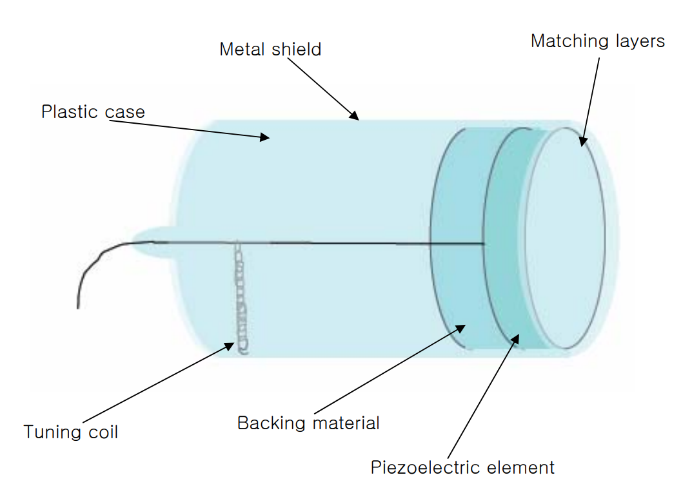
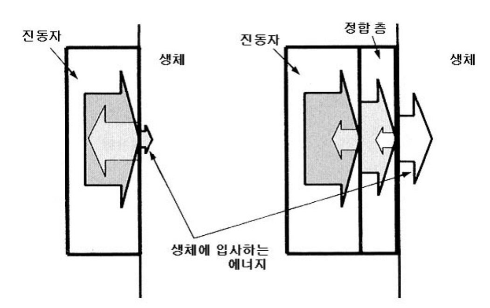
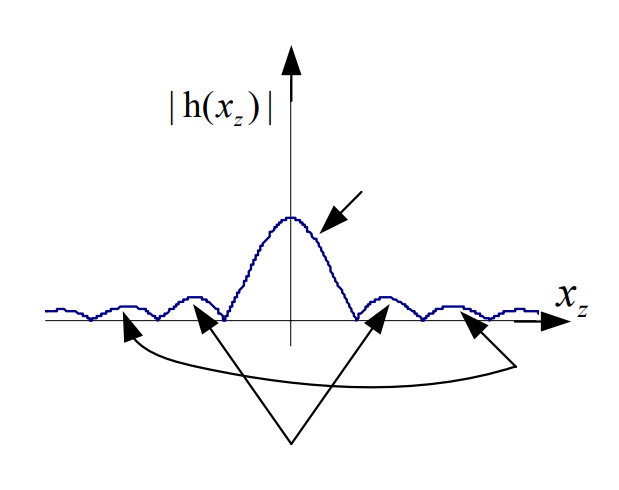

# 단일 소자(single element) 트랜스듀서
초음파 진단기용 트랜스듀서에는 single element와 array가 있는데 이번 포스트에서는 single만 다룬다.

## 압전효과(Piezoelectric effect)  

**압전효과**: 수정(crystal)과 같은 압전체를 누르면(압력을 가하면) 전기가 생기는 효과  

요즘의 초음파진단기에 사용되는 압전체는 대부분 **PZT**이다.

> 여기서 PZT는 P:납, Z:지르코늄. T:티타늄을 의미하는 것으로 세라믹에 이러한 원소들을 첨가해 구운 재료이다.  

첨가물을 넣은 PZT는 압전성이 거의 없는 소재인데 압전성을 띠게 하려면 미세 결정들이 한 쪽 방향으로 정렬시켜야 한다. 여기서 미세 결정들이 같은 방향으로 정렬하는 것을 **분극(Poling)** 이라고 한다.  

PZT를 분극 상태로 만들기 위해 Curie온도 이상으로 물질을 가열하고 높은 전압을 일정 시간 소자에 가하며 식히는 과정을 통해 **분극 상태의 PZT**를 얻는다.  

분극 상태의 PZT, 즉 압전소자에 펄스 전압을 가하면 압전현상으로 인해 소자에 순간적으로 압력이 작용하여 순간적인 변형이 발생했다가 원래의 모양으로 되돌아오는데 이때 소자 자체의 고유 진동주파수(공진 주파수)에 따라 어느 시간동안 진동한다. 이 때의 **고유진동주파수**는 **두께**에 반비례하고 **소자 내의 음속** 에 비례한다.

## 트랜스듀서의 기본 구조  
  

### 압전소자 (piezoelectric element)
압전소자는 위에서 언급한 것처럼 초음파를 발생시키고 받아들이는 역할을 한다.  
- **소자의 고유진동주파수**와 **입력되는 전기신호의 주파수**가 같을 때 가장 효율적으로 초음파로 변환되어 내보낼 수 있다.  

- 반대로 받아들이는 **초음파(반사되는 초음파)의 주파수**가 **공진주파수**와 같을 때 가장 효율적으로 전기신호로 변환된다.

### 정합층 (Matching Layer)  
압전소자와 인체 연부조직의 음향 임피던스 차이는 약 20배 정도된다. 그렇기 때문에 압전소자에서 바로 연부조직으로 초음파를 발생시킨다면 대부분은 경계면을 투과하지 못하고 반사된다. 일부 투과한 초음파도 대부분이 연부조직으로 반사되어 나간다. 이러한 문제, 즉 **음향 임피던스의 차이를 줄여주는 것이 정합층의 역할** 이다.  

정합층을 적절한 두께와 물질(적절한 음향 임피던스를 갖는 물질)로 만든다면 위와 같은 반사를 없애주어서 전달 효율이 최대로 할 수 있다.  
- **정합층의 적절한 두께**는 $\frac{\lambda}{4}$이어야 한다.  
- **적절한 정합층의 음향 임피던스**는 다음과 같다. $Z_{정합층} = \sqrt{Z_{연부조직} \times Z_{압전소자}}$

하지만 위와 같은 음향 임피던스를 만족하는 소재를 찾는 것은 어려우므로 아래의 그림과 같이 정합층을 두 층으로 만드는 경우가 많다.  

### 배킹 물질 (Backing Material)
압전소자에 전압을 가하면 초음파는 압전소자의 앞, 뒷면 모두 발생하게 된다. 하지만 우리는 초음파가 앞으로만 진행되는 것을 원하므로 **뒤로 가는 초음파는 없애야 하고 이런 역할은 배킹 물질**이 해준다.  
또한 **진동을 억제하여 펄스 폭을 짧게 해주는 것을 댐핑(damping)** 이라 하는데 이러한 기능도 배킹 물질이 담당한다. 짧은 펄스 전기신호를 트랜스듀서에 가해 준 경우, 발생하는 초음파의 길이는 댐핑을 많이 할수록 짧아진다. 하지만 초음파의 세기 또한 약해지므로 트랜스듀서의 효율 또한 떨어지게 된다.  
마지막으로 트랜스듀서를 받쳐 줌으로써 프로브를 기계적 충격으로부터 보호한다.

## 단일 소자 트랜스듀서와 음장

### 음장  
**음장**: 음파가 전파하는 영역  
단일 소자 트랜스듀서에 CW의 전기신호를 가하면 아래 그림과 같은 음장이 발생한다.  

> *CW란, continous wave의 약자로 일정한 진폭과 주파수를 가지는 정현파(sinusoidal wave)를 의미*  
> 
> *무한대의 면적을 가진 평면진동자는 초음파가 평면파가 되어 진행하지만, 유한한 면적의 평면진동자는 아래 그림과 같이 음파가 진행한다.*  

  

### 호이겐스 원리
**파면**: 위상이 같은 지점을 연결한 선이나 면, 즉 골과 골 또는 마루와 마루를 이은 선으로 이는 파동 진행 방향에 수직이다.  
**호이겐스 원리**: 파면은 점파원들이 만들어낸 구면파의 접선이다.  

위의 그림 3을 보면 **근거리 음장(Fresnel zone; 근거리 갑섭대)** 에서는 초음파가 복잡하게 간섭하며 진행한다. 해당 영역에서는 근사적으로 평면파로서 전파하고 있다고 생각할 수 있다.  

**원거리 음장(Fraunhofer zone)** 에서는 근사적으로 구면파가 되어 넒게 전파한다.  

근거리 음장과 원거리 음장은 **$D^2/(4*\lambda)$** 를 기준으로 나눠진다. 트랜스듀서의 압전소자부터 해당 기준까지의 거리는 Focal length라고 부른다.  
*여기서 D는 진동자의 직경(aperture size)이고 $\lambda$는 초음파의 파장을 의미한다.*  

#### 근거리 음장(Fresnel zone; 근거리 갑섭대)  
근거리 음장에서 빔의 모양은 트랜스듀서의 aperture의 모양을 그대로 유지하며 진행한다. 하지만 일정한 진폭의 초음파를 계속 방사하더라도 근거리 음장의 진폭은 일정하지 않고 상당히 변화가 심한 것을 확인할 수 있다. 이러한 패턴은 빔 진행방향에 따라서도 변화가 심하다.

#### 원거리 음장(Fraunhofer zone)
원거리 음장은 근거리 음장에 비해 단순한 진폭 패턴을 보인다. 전체적으로 구면파에 가까운 형태로 거리에 따라 점차 퍼져나가는데 이를 그림3에서 아래 위 방향으로 잘라 음장의 진폭을 살펴보면 그림 4와 같다.  

  

그림 4의 가로 축이 그림 3의 세로 축에 해당하고, 그림 4의 세로 축은 진폭의 절대값을 나타낸다.  
그림 4에서 진폭($|h(x_z)|$)이 가장 큰 부분을 메인 로브(main lobe;주엽)이라 부르고 그 다음으로 진폭이 큰 부분을 제 1 사이드로브(1'st side lobe;부엽)라고 부른다.