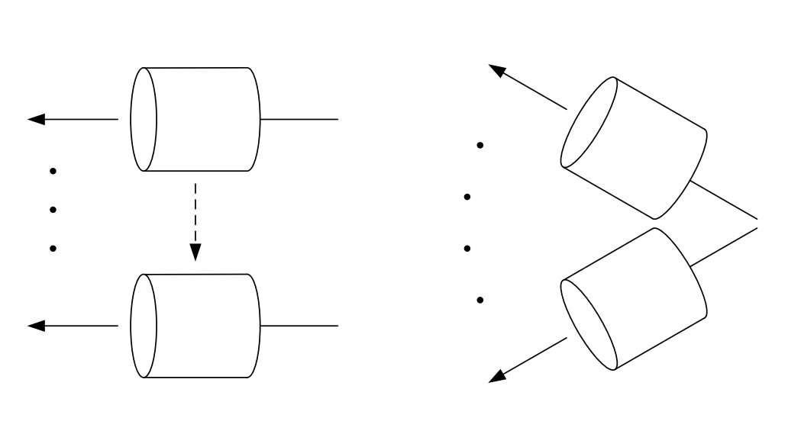
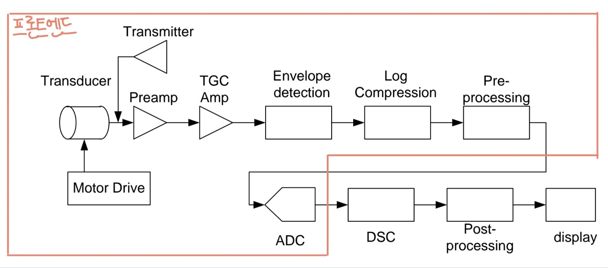

# 초음파 신호 처리
이번 포스트에서는 아날로그 초음파 진단기에서의 신호 흐름에 대해 설명할 예정이다.  
## 단일 소자 트랜스듀서를 사용한 B-모드 스캔
단일 소자 트랜스듀서를 통해 B-모드 스캔을 한다면 그림 1과 같은 방법으로 스캔이 진행된다.  

  

왼쪽의 방법은 리니어 스캔 방법은 초창기의 스캔방식으로 사용자의 숙련도에 따라 영상 차이가 많이 난다는 단점이 있다.  
오른쪽의 섹터 스캔 방법은 이후에 나온 스캔 방법으로 모터로 자동으로 구동이 되는 방식이다. 

---

위와 같이 스캔하여 얻은 신호들은 아래와 같은 방법으로 처리가 되어 영상이 구성된다.  

그림 2은 아날로그 초음파 진단기의 신호 흐름을 보여주는 그림이다.  

  

각 블록들에 대해 순차적으로 설명하자면 아래와 같다.  

### Transmitter (송신기)
Transmitter는 초음파를 발생시키기 위해 비교적 높은 펄스 전압을 발생하는 부분이다.

### Preamp (초단 증폭기)
Preamp는 되돌아온 초음파 에코 신호(*반사된 초음파 신호를 의미*)를 최초로 증폭하는 곳이다.  
여기서 유의해야할 점은 Preamp에서 증폭된 잡음 신호는 시스템 자체의 잡음 특성을 결정지을 수 있으므로 Preamp에서 잡음을 적게 발생시키도록 설계해야 한다는 점이다.

### TGC amp(Time-Gain-Compensation)or DGC amp(Depth-Gain-Compensation)
[초음파 물리 포스트](https://juwonk-bme.netlify.app/docs/bme/posts/ultrasound1#%EA%B0%90%EC%87%A0)에서 정리했듯이 초음파에서의 감쇠량은 아래와 같이 표현할 수 있다.  
$$감쇠량[dB] = 감쇠계수[dB/cm] \times 진행거리[cm] \times 주파수[MHz]$$  
즉, 진행거리 또는 깊이에 따라서 감쇠가 크게 되는데 이를 고려하여 영상을 구성하지 않으면 가까운 곳의 영상은 밝게 나오고 깊어질수록 어두운 영상을 얻게 된다.  
이러한 현상에 대한 대책이 **TGCamp** 혹은 **DGCamp**이다.  

> 초음파진단기에서 TGCamp와 DGCamp를 같게 보는 이유는 초음파가 깊은 곳에서 반사된다면 에코가 돌아오는 시간도 길어지기 때문이다.  

정리하면 TGCamp는 근거리의 echo신호는 거의 증폭하지 않고 먼 곳의 echo신호는 지수함수적으로 증폭시킨다.  
*지수함수적으로 증폭시키는 이유는 dB scale관점에서 보면 선형적이기 때문*

#### Receiver Gain (수신 이득)

### Envelope detection (포락선 검파)

### Log Compression (대수 압축)